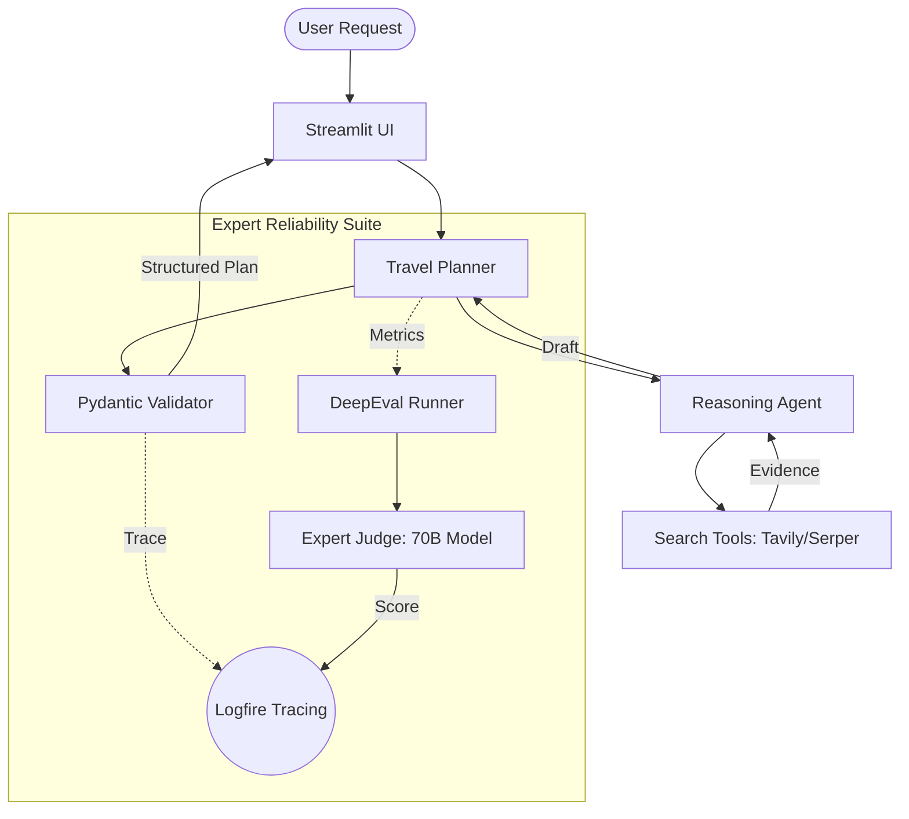

# 🛩️ AI Travel Planner: Production Reliability Suite 🌍

A production-grade AI Travel Planner built with **LangChain**, **Pydantic Logfire**, and **DeepEval**. This project moves beyond standard chatbots by implementing a strict reliability loop with structured output and expert-level LLM-as-a-judge evaluation framework.

Here is a snapshot of the Travel Itinerary Generator UI:




## 🚀 Key Features

-   **Structured Reliability**: Uses Pydantic to ensure every itinerary follows a machine-readable schema. No more broken Markdown or inconsistent results.
-   **Expert Judging**: Evaluates agent performance using **DeepSeek R1 / Llama 70B** models to score Answer Relevancy, Faithfulness, and Search Intent.
-   **Full-Stack Observability**: Powered by **Logfire**. Trace every step from the first user click to the raw search results and the final judge's score.
-   **Global & Indian Presets**: A comprehensive "Golden Dataset" covering diverse destinations from Tokyo and Rome to Mumbai and Kerala.

## 🛠️ Tech Stack

-   **Orchestration**: LangChain
-   **Models**: Groq (Llama 3.3 70B & 8B)
-   **Observability**: Pydantic Logfire
-   **Evaluation**: DeepEval
-   **UI**: Streamlit
-   **Infrastructure**: Docker, Kubernetes, ELK Stack

## 📂 Project Structure

```text
ai-travel-planner/
├── src/
│   ├── agents/          # AI agents logic (Travel Agent)
│   ├── config/          # Configuration management
│   ├── core/            # Core application logic
│   ├── models/          # Pydantic models for structured output
│   ├── tools/           # Search and external tool integrations
│   └── utils/           # Helper functions and utilities
├── evals/               # Evaluation scripts and gold standard datasets
├── experiments/         # Experimental notebooks and research scripts
├── project_documentation/ # Detailed technical guides
├── app.py               # Streamlit UI entry point
├── requirements.txt     # Python dependencies
├── Dockerfile           # Production container setup
└── k8s-deployment.yaml # Kubernetes orchestration configs
```

## 🚦 Getting Started

### 1. Configure Environment
Create a `.env` file with your API keys:
```env
GROQ_API_KEY=your_key
JUDGE_GROQ_API_KEY=your_key_for_judge
LOGFIRE_TOKEN=your_logfire_token
TAVILY_API_KEY=your_key
SERPER_API_KEY=your_key
```

### 2. Run the Application
```bash
streamlit run app.py
```

### 3. Run Reliability Evaluations
Run the 5-metric "Ultimate Reliability Suite":
```bash
python -m tests.eval_runner
```

## 📖 Documentation
Detailed guides are available in the `project_documentation/` directory:
1. [Observability & Tracing](project_documentation/03_observability_suite.md)
2. [Evaluation Fundamentals](project_documentation/04_evaluation_core.md)
3. [Metrics Deep Dive](project_documentation/07_reliability_metrics.md)

---
*Created with focus on Reliability, Observability, and Expert-Level AI Performance.*
