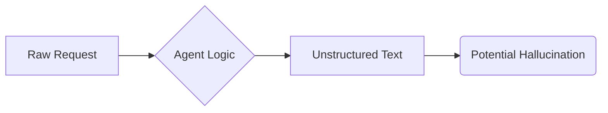

# 01 - Project Background: Before Reliability

Every great journey starts with a challenge. Before we implemented this reliability suite, the AI Travel Planner was a "Black Box." 

### The "Before" State
Initially, the application was a straightforward LangChain agent. While functional, it suffered from three major problems which made it risky for production use:

1.  **Response Variance (The "Fickle" AI)**: Sometimes the AI would return beautiful Markdown, other times it would give raw snippets. There was no guarantee that the output would follow a consistent structure.
2.  **The Hallucination Risk**: The AI could confidently suggest a hotel that doesn't exist or a flight price from 2019 because it lacked a rigorous "Truth Check."
3.  **Invisible Logic**: When the AI failed or behaved strangely, we couldn't see *why*. We didn't know if it searched the web, if the search failed, or if it just ignored the results.

### Summary of System Risk
| Risk | Description | Impact |
| :--- | :--- | :--- |
| **Parsing Errors** | No strict schema for data. | Crashes in the UI or downstream systems. |
| **Trust Issues** | No automated faithfulness checks. | Users get wrong/outdated travel advice. |
| **Debugging Hell** | No tracing of internal steps. | Developers spend hours guessing what went wrong. |

### The Goal
Our mission was to transform this "Black Box" into a **Reliable, Observably, and Verifiable** engine.

In the next file, we'll see exactly how we evolved the code to solve these risks.
