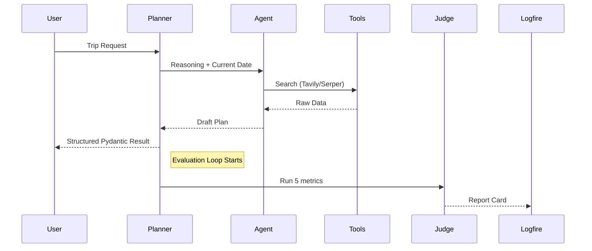

# 02 - The Evolution: Major Architectural Changes

To move from a "Black Box" to a Reliable System, we refactored the core of the application. Here is exactly what changed.

### 1. Refactoring the Planner (The Brain)
We updated the `TravelPlanner` in `src/core/planner.py`. Instead of just firing a request and hoping for the best, the planner now:
- **Injects Real-Time Awareness**: It automatically adds the current date to every prompt.
- **Captures Evidence**: It records which tools were called and what they said (Retrieval Context).
- **Supports Structured Formatting**: It passes the agent's work through a validator before returning it to the user.

### 3. Native LangChain v1.x & Middleware
We migrated to the modern LangChain 1.x `create_agent` architecture, which introduces **Middleware**:
- **Rate Limit Resilience**: The `TravelAgentMiddleware` intercepts every turn and adds mandatory 2-5s "breathing space" to prevent hitting Groq's 12,000 TPM limit.
- **Context Isolation**: By resetting the planner's state for each city, we prevent "memory leaks" where data from Paris would show up in a Tokyo itinerary.
- **X-Ray Observability**: Every tool call is automatically instrumented via Pydantic Logfire, meaning you can see the *raw search results* for every trip.
Our new logic follows a structured path that can be visualized as a reliable loop:

### Key Logic Comparison
| Feature | Old Version | New (Reliable) Version |
| :--- | :--- | :--- |
| **Input** | Raw User Query | Query + Dynamic Real-Time Context |
| **Process** | Hidden steps | Transparent, traced tool calls |
| **Output** | Freetext (Random) | Validated Pydantic Object |
| **Verification** | Manual (Eyes only) | Automated (Expert Judge) |

---

In the next file, we'll dive into how we enabled "X-Ray Vision" for your code using Logfire and Pydantic.
