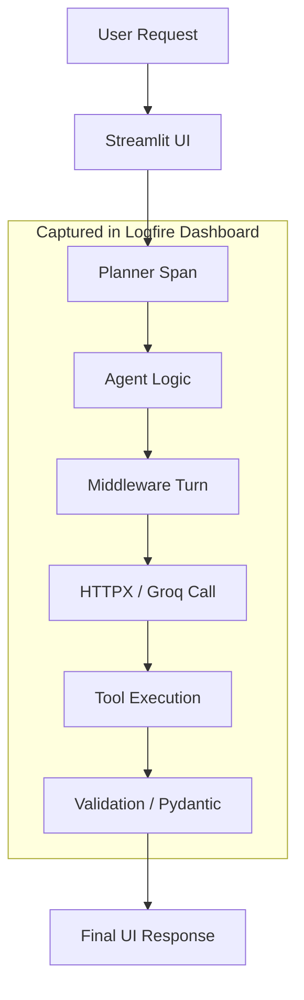

# 03 - Observability Suite: Pydantic & Logfire

To trust our AI, we need to **Validate** its work and **Trace** its steps. This suite ensures that we have "X-Ray Vision" into every decision the agent makes.

### 1. Pydantic (The Reliability Border)
Think of Pydantic as a **Security Checkpoint** at an airport. 
- **The Role**: It defines a strict schema (in `src/models/travel_models.py`). Every time the AI generates a plan, Pydantic inspects it.
- **Why?**: If the AI forgets to include a price or gives a day number of "Banana", Pydantic catches it immediately before it reaches the user.
- **Our Implementation**: We use `model.with_structured_output(TravelPlan)`. This forces the LLM to think in terms of JSON objects rather than loose text.

### 2. Logfire (The Flight Recorder)
Logfire provides full-stack tracing for your application. 
- **Tracing**: Every button click in Streamlit, every HTTP request to Groq, and every evaluation metric is recorded as a "Span."
- **Full-Stack Visibility**: Because we used `logfire.instrument_httpx()` and `logfire.instrument_pydantic()`, we can see exactly how long a search took and if the resulting data passed our quality checks.

### 3. Middleware (The Turn-by-Turn Watcher)
The `TravelAgentMiddleware` in `src/agents/travel_agent.py` acts as an observer for every "turn" the AI takes.
- **Observability**: It logs exactly when a model starts thinking and when it finishes.
- **Control**: It allows us to add mandatory "breathing space" (pauses) to respect API rate limits while keeping the logs clean and easy to read.

---

### 🔄 The Observability Flow

### 4. Key Benefits of this Combo
- **Data Integrity**: You never have to worry about broken UI layouts due to unexpected AI responses.
- **Debugging**: When a user says "the search failed," you can open Logfire and see exactly which tool call timed out or returned no results.
- **Performance**: We can see exactly which parts of the search are slow and optimize them (e.g., truncating long results).

---

In the next file, we'll explain the core terminologies of **Evaluations** and "LLM-as-a-Judge."
