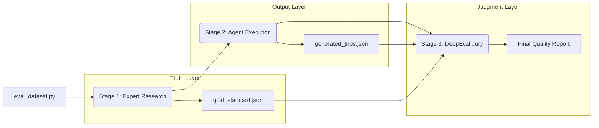

# 04 - Evaluation Core: Tuning the Expert

An AI Agent is only as good as the system that tests it. Evaluation is the process of automatically judging if your AI's outputs are high quality.

### 1. What is an Evaluation?
In standard software, we use **Unit Tests** (e.g., `2 + 2 == 4`). In AI, the output is probabilistic (it changes every time). Evaluations move us from "Vibes-based testing" to **Data-backed testing**.

### 2. LLM-as-a-Judge
Since travel plans are subjective, we need a judge that understands context.
- **The Concept**: We use a second, more powerful LLM (The "Expert Judge") to inspect the work of the first LLM (The "Agent").
- **Our Implementation**: We use **Llama-3.3-70B-Versatile** as the Judge. It checks for things like consistency, tone, and factual accuracy. 

### 3. Decoupled 3-Stage Pipeline
To stay under API limits and ensure accuracy, we separated the evaluation into three distinct stages:

### 4. Key Terminology
| Term | Meaning |
| :--- | :--- |
| **Ground Truth** | The "Perfect Answer" we compare against. |
| **Trace** | The step-by-step history of what the AI did. |
| **Score** | A number between 0 and 1 representing quality. |
| **Reasoning** | The explanation the Judge gives for its score. |

---

In the next file, we'll explain the raw materials of evaluation: **Goldens, Datasets, and Test Cases.**
