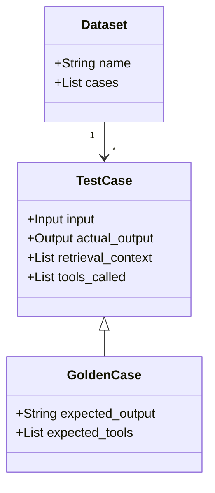

# 05 - Goldens, Datasets, and Test Cases

To test an AI, we need a "Lab Environment." This file explains the ingredients we use to build that environment.

### 1. The Test Case (The Individual Test)
A **Test Case** is a single unit of evaluation. In our app, it consists of:
- **Input**: The user's query (e.g., "Plan a 3-day trip to Mumbai for History lovers").
- **Actual Output**: What the AI generated in real-time.
- **Retrieval Context**: The web search data the AI used.
- **Tools Called**: Which tools (Tavily/Serper) were triggered.

### 2. The Golden Set (The Ideal Reality)
A **Golden Case** is a test case where we have "Ground Truth"—the perfect output we *wish* the AI would generate every single time. 
- We store these in `tests/eval_dataset.py`.
- They serve as the "Beacon" for the AI to follow.

### 3. The Dataset (The Collection)
A **Dataset** is simply a collection of these Golden Cases. Our dataset is diverse to ensure **Generalization**:
- **Global reach**: Tokyo, Paris, Rome, New York.
- **Indian focus**: Mumbai, Kerala, Varanasi.
- **Interest focus**: History, Nightlife, Nature, Technology.

### Why this matters?
By running our agent against this entire **Golden Dataset**, we can calculate a **Reliability Score**. If the AI works for Paris but fails for Varanasi, we know exactly where our prompts need improvement!

---

In the next file, we'll look at the engine that runs these tests: **DeepEval.**
