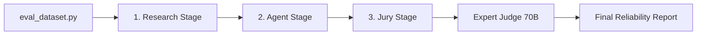

# 06 - DeepEval: The Evaluation Engine

To automate our quality checks, we use **DeepEval**, an industry-standard framework for LLM unit testing.

### 1. How DeepEval Works
DeepEval coordinates the "Reliability Jury." It takes our Agent's generated plans, compares them to our Ground Truth research, and then hands everything over to the Expert Judge for scoring.

### 2. Our "Expert Judge" Wrapper
We implemented a custom `LangChainDeepEvalWrapper`. This is a critical piece of engineering that allows DeepEval (which usually expects its own specific drivers) to use your **LangChain models natively**.
- **The Key Advantage**: This means your "Judge" is using the exact same technology as your "Agent," but with a higher-reasoning model (70B) and a separate API key for safety.

### 3. The 3-Stage Pipeline Logic
Instead of a single "tangled" script, we now follow a clear path:
- **Research Stage**: Uses `create_gold_data.py` to find the truth.
- **Agent Stage**: Uses `generate_trips.py` to create the itineraries.
- **Jury Stage**: Uses `evaluate_trips.py` to run the metrics.

---

### 🔄 The Evaluation Flow

### 4. Metrics & Justification
For every city we test, the "Jury" provides:
- **Numerical Scores**: A grade from 0 to 1.
- **Reasoning**: A written explanation from the Judge justifying why a particular score was given. This is invaluable for debugging!

---

In the final file, we will do a deep dive into the **Core Metrics** and what they actually measure.
