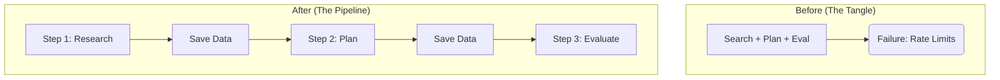

# 8 - The Decoupled Strategy: Why Separate Stages?

In the beginning, we tried to do everything at once: Search, Plan, and Evaluate in one single loop. **It failed.** Here is why we changed it and why it's better now.

### 1. The Problem: "The Token Wall"
When you do everything at once, the AI system gets overwhelmed. It's like trying to cook an 8-course meal in one tiny pot. 

*   **Rate Limits**: The API would stop us because we were sending too much data too fast.
*   **Errors**: If one small thing failed at the end, we lost everything we had already searched for.

### 2. The Solution: Decoupling
We "decoupled" the system. This means we broke it into 3 separate, manageable steps.

### 3. Why this is better for everyone
This new design is **Resilient**. It means:
1.  **Safety**: We can add pauses between steps to stay under the free limits of the API.
2.  **Savings**: If the evaluation fails, you don't have to pay for the search again. You already have the data saved on your computer!
3.  **Accuracy**: Each stage can focus on doing one thing perfectly.

### Summary
By separating the stages, we moved from a "fragile" experiment to a **Robust Machine**.

---
*This documentation is part of the Project Reliability Suite.*
